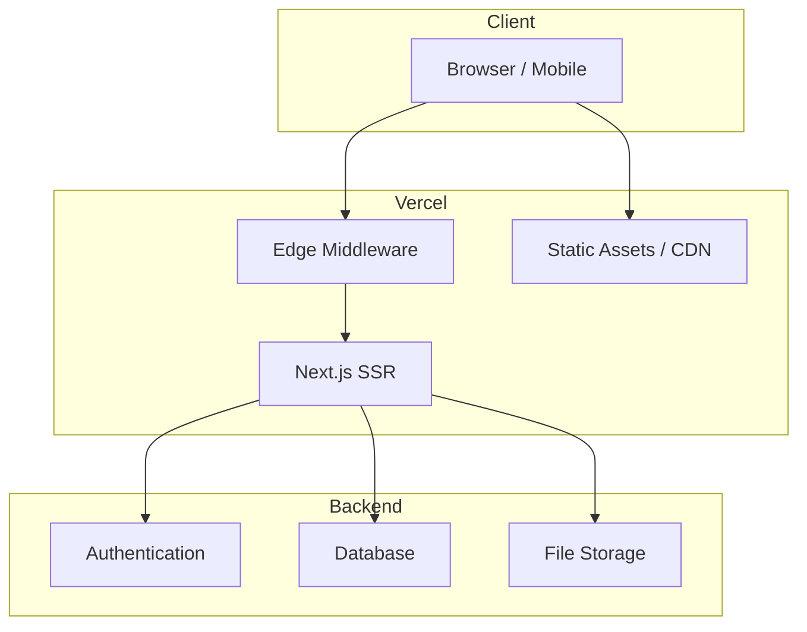

# Deployment Diagram

> Infrastructure and provider relationships. Update on infra changes.

```mermaid
graph TB
    subgraph "Client"
        Browser[Browser / Mobile]
    end

    subgraph "Vercel"
        Edge[Edge Middleware]
        SSR[Next.js SSR]
        Static[Static Assets / CDN]
    end

    subgraph "Backend"
        Auth[Authentication]
        DB[Database]
        Storage[File Storage]
    end

    Browser --> Edge --> SSR
    Browser --> Static
    SSR --> Auth
    SSR --> DB
    SSR --> Storage
```
