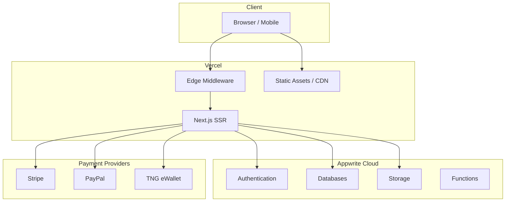

# Deployment Diagram

> Infrastructure, environments, and provider relationships. Update on infra changes.

```mermaid
graph TB
    subgraph "Client"
        Browser[Browser / Mobile]
    end

    subgraph "Vercel"
        Edge[Edge Middleware]
        SSR[Next.js SSR]
        Static[Static Assets / CDN]
    end

    subgraph "Appwrite Cloud"
        Auth[Authentication]
        DB[Databases]
        Storage[Storage]
        Functions[Functions]
    end

    subgraph "Payment Providers"
        Stripe[Stripe]
        PayPal[PayPal]
        TNG[TNG eWallet]
    end

    Browser --> Edge --> SSR
    Browser --> Static
    SSR --> Auth
    SSR --> DB
    SSR --> Storage
    SSR --> Stripe
    SSR --> PayPal
    SSR --> TNG
```
