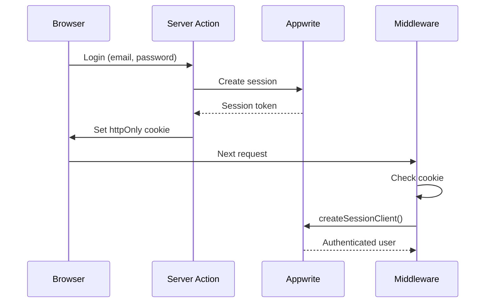
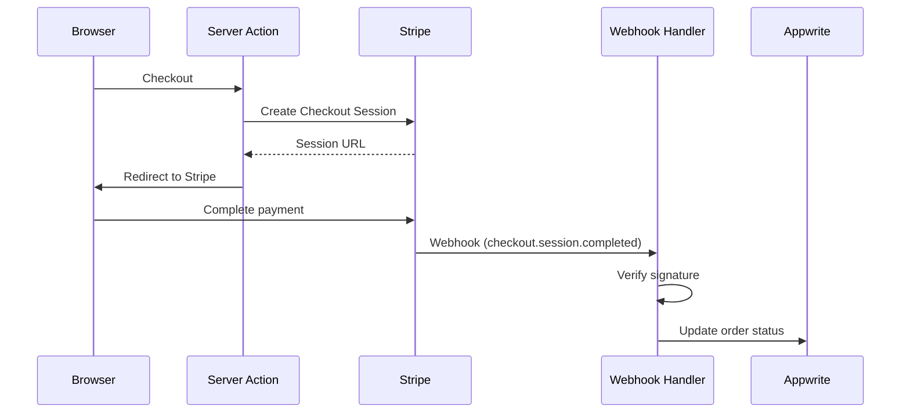

# Sequence Diagrams

> Request flows: auth, payments, API lifecycle. Update on ANY new flow.

## Auth Flow

```mermaid
sequenceDiagram
    participant B as Browser
    participant SA as Server Action
    participant AW as Appwrite
    participant MW as Middleware

    B->>SA: Login (email, password)
    SA->>AW: Create session
    AW-->>SA: Session token
    SA->>B: Set httpOnly cookie
    B->>MW: Next request
    MW->>MW: Check cookie
    MW->>AW: createSessionClient()
    AW-->>MW: Authenticated user
```

## Stripe Payment Flow

```mermaid
sequenceDiagram
    participant B as Browser
    participant SA as Server Action
    participant S as Stripe
    participant WH as Webhook Handler
    participant AW as Appwrite

    B->>SA: Checkout
    SA->>S: Create Checkout Session
    S-->>SA: Session URL
    SA->>B: Redirect to Stripe
    B->>S: Complete payment
    S->>WH: Webhook (checkout.session.completed)
    WH->>WH: Verify signature
    WH->>AW: Update order status
```

<!-- Add PayPal, TNG, and custom flows as implemented -->
