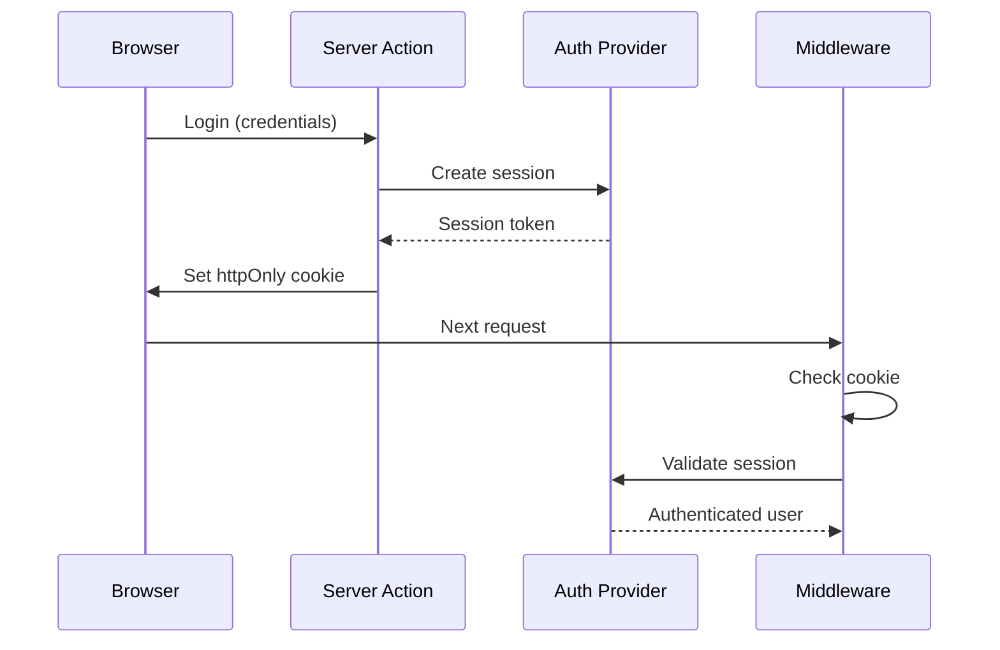

# Sequence Diagrams

> Request flows: auth, API lifecycle. Update on ANY new flow.

## Auth Flow

```mermaid
sequenceDiagram
    participant B as Browser
    participant SA as Server Action
    participant Auth as Auth Provider
    participant MW as Middleware

    B->>SA: Login (credentials)
    SA->>Auth: Create session
    Auth-->>SA: Session token
    SA->>B: Set httpOnly cookie
    B->>MW: Next request
    MW->>MW: Check cookie
    MW->>Auth: Validate session
    Auth-->>MW: Authenticated user
```

<!-- Add API flows, webhook flows, etc. as implemented -->
