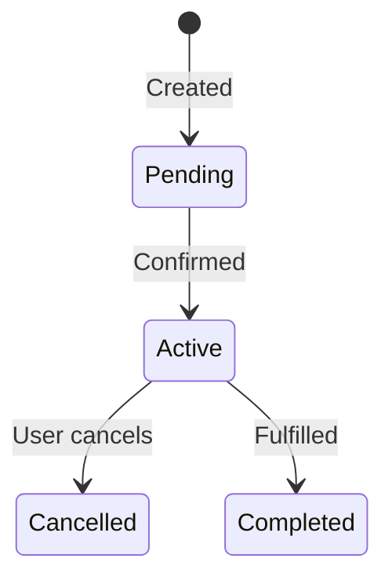

# State Machine Diagrams

> Stateful entities: orders, subscriptions, etc. Update when status logic changes.

<!-- Add state machines as stateful entities are created -->
<!-- Example:

```mermaid
stateDiagram-v2
    [*] --> Pending: Created
    Pending --> Active: Confirmed
    Active --> Cancelled: User cancels
    Active --> Completed: Fulfilled
```
-->
