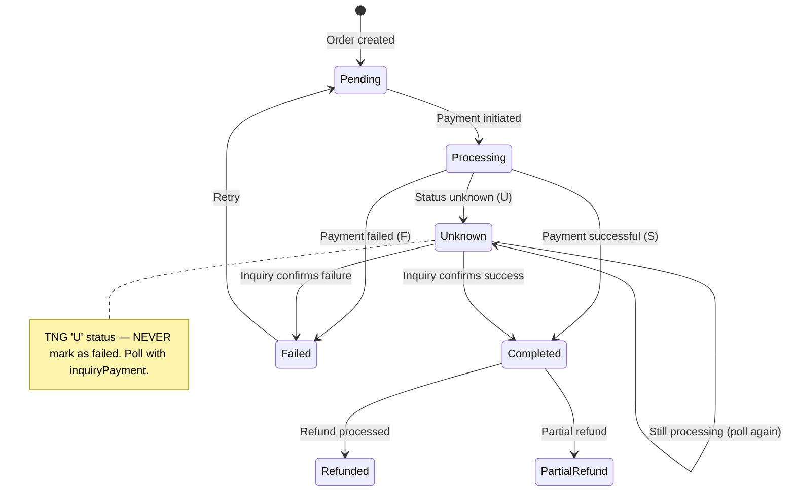

# State Machine Diagrams

> Stateful entities: orders, payments, subscriptions. Update when status logic changes.

## Payment Status

<!-- Add order status, subscription status, etc. as entities are created -->
